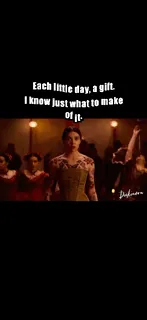
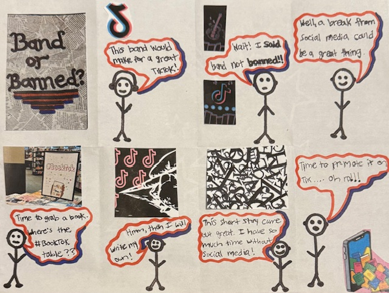

# Heading

## This is a portfolio of my work that connects feminist rhetoric with poetics. Please enjoy some samples of my work. These connect with my research interests surrounding feminist rhetoric and poetics in digital spaces. Each sample builds upon one another to help create a narrative surrouding marginalized voices, interactive designs, and future considerations. 

## Below are links to some of my works. These range from phsycial creations to works derived from various digital platforms. 
- [self_portrait](IMG_0244.PNG)

- [juxtapositions_of_life](the_juxtapositions_of_life-1.html) 

- [Defining_women](Defining_Women_Beckman-1.html)

- [my_mapping_of_feminism](Blooming.html)

- [blooming](Blooming.html)

- {self_portrait}(IMG_0244.PNG)
